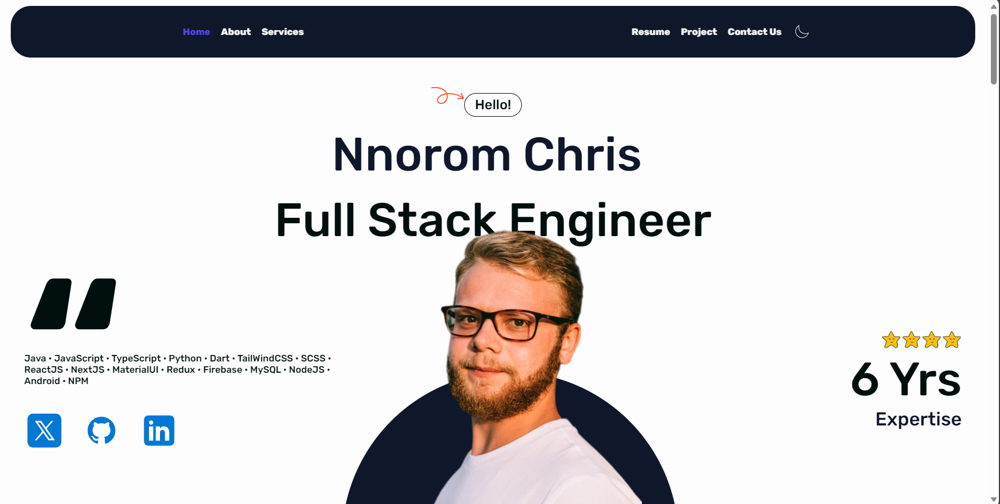

# Nnorom Christian Portfolio

## Overview

Welcome to my portfolio! This repository showcases my work, skills, and experiences in the field of Full Stack Development. Feel free to explore and learn more about what I have to offer.

## Table of Contents

- [About Me](#about-me)
- [Projects](#projects)
- [Skills](#skills)
- [Resume](#resume)
- [Contact](#contact)

## About Me

👋 Hello! I'm Nnorom Christian, a passionate and results-driven Software Development based in earth. With a keen interest in Full Stack Dev.

💡 Leveraging my background in Computer Science and hands-on experience in Key Skills and Technologies, I am dedicated to Serving.

🚀 Throughout my career, I have had the opportunity to work on impactful projects such as

- Search Algorithm for companies.
- Landing Pages for companies.

These experiences have honed my skills in Development and equipped me with the ability to accomplish any and every possible achievements.

🌐 Always eager to learn and stay ahead in the dynamic world of this Industry, I am committed to pushing boundaries and contributing to the society.

🤝 Let's connect and explore how my skills and passion align with your needs. Whether it's collaborating on exciting projects, discussing industry trends, or just having a conversation, I'm always open to new opportunities and connections.

Feel free to reach out! [Contact](#contact)

## Projects

### Project 1: [Bank Management System]([link-to-project-1](https://github.com/nnoromiv/bankManagementSystem))

- The Bank Management System is a Java application that enables users to perform various banking operations. It includes features like user authentication, account creation, and transaction management.
- Java, HTML
- [Link](https://github.com/nnoromiv/bankManagementSystem)

### Project 2: [Car Show](https://github.com/nnoromiv/CarShow)

- This web application uses API to show car data and details to users
- TypeScript, CSS, JavaScript
- [Link](https://github.com/nnoromiv/CarShow)

... (add more projects as needed)

## Skills

List of my key skills, technologies, and tools that you are proficient in. You can categorize them based on your expertise.

- **Programming Languages:** Java, Python, Dart, JavaScript, HTML, CSS
- **Frameworks:** React, Node.js, NextJs, Vite
- **Database:** MongoDB, MySQL, POSTGRESQL
- **Other Tools:** Git, VS Code, Firebase etc.

## Resume

Include a link to your detailed resume or CV.

[Resume](https://www.linkedin.com/in/nnorom/)

## Contact

Feel free to reach out for collaboration, job opportunities, or just to say hello!

- **Email:** <nnorom.prince44@gmail.com>
- **LinkedIn:** [Your LinkedIn Profile](https://www.linkedin.com/in/nnorom/)
- **GitHub:** [Your GitHub Profile](https://github.com/nnoromiv)
- **Portfolio Website:** [Portfolio Website](https://www.nnorom.netlify.app)

## License

This project is licensed under the [MIT License](LICENSE).
